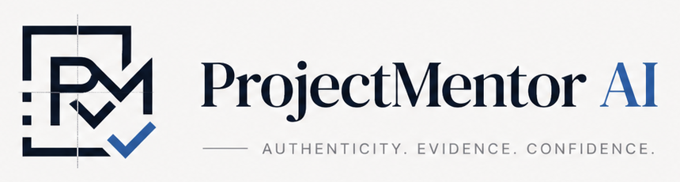

# ProjectMentor AI（PMAI）品牌与 Logo 使用政策

最后更新：2026-08-24

本文件用于说明 ProjectMentor AI（简称 **PMAI**）名称、Logo、图标、字标、组合标识和品牌视觉元素的权利归属、官方版本与使用边界。

## 1. 权利归属

ProjectMentor AI（PMAI）的品牌命名、设计方向、构图选择、修改与最终定稿由李鑫哲完成并发布；部分制图与文件制作过程使用了数字工具或 AI 辅助。本声明仅主张依法可由权利人享有的品牌、商标及著作权权益，不虚构创作过程。

Copyright © 2026 李鑫哲. All rights reserved.

`ProjectMentor AI`、`PMAI` 及其相关 Logo、图标、字标、组合标识、品牌板、配色与视觉表达，均作为本项目的品牌资产保留。除本文件明确允许或作者另行书面许可外，不授予任何商标、服务标识、Logo、品牌名称、商业外观或其他品牌权利。

公开源代码、允许查看或允许 GitHub Fork，不代表授予品牌使用权，也不代表任何人可以将 PMAI 品牌用于自己的产品、服务或宣传。

## 2. 官方版本记录

### V1：初版横向 Logo（历史版本）

- 状态：历史版本，仅用于品牌演进记录；
- 原始参考图：206 × 46 px；
- 仓库归档：1000 × 240 viewBox SVG；
- 格式：SVG / sRGB；
- 主要结构：渐变圆角 `PM` 图标 + `ProjectMentor AI` 横向字标；
- 归档 SVG SHA-256：`c3e842c1fc83fb519b8b3347ed864f438be7581bad9aa7c3c8fa69429560a2bc`。

### V2：新版 PMAI 品牌体系（当前版本）

- 状态：当前官方品牌版本；
- 官方主标识资产：PNG / sRGB；
- 组合：Primary、Compact、Icon、Monochrome、Inverted；

仓库内当前产品界面使用的官方裁切资产位于：

- `frontend/projectmentor-web/src/assets/brand/cropped/brand-board-primary.png`
- `frontend/projectmentor-web/src/assets/brand/cropped/brand-board-compact.png`
- `frontend/projectmentor-web/src/assets/brand/cropped/brand-board-icon.png`
- `frontend/projectmentor-web/src/assets/brand/cropped/brand-board-inverse-primary.png`

对应 SHA-256 依次为：

- Primary：`d08415abf351589b65e23c3c934df6b42a41e4b80f6597cd175426bc28b241b9`；
- Compact：`8b6ba19cc0acac99cdbee0d21069d68bd4fdb7ac8353331e3e69e716edeb8e1f`；
- Icon：`911a5cbfca3d760a7db070245bb7858d1251c97e7899fb37897f15b6fd49551f`；
- Inverted Primary：`6eb6be2f126b1a3af67b7432e501850ac7b8282e4284eae2d23776cd21e5d8e5`。

以上文件指纹用于核对本次归档文件是否发生变化。Git 提交记录可作为公开版本记录的一部分，但不等同于商标注册证或对权利归属的最终法律认定。

## 3. 新版基础参数

### 色彩

| 名称 | 色值 | 建议用途 |
| --- | --- | --- |
| Ink | `#0B1220` | 主标识、深色背景 |
| Graphite | `#2B313B` | 正文与辅助深色 |
| Stone | `#E6E8EB` | 分隔线与中性背景 |
| Paper | `#F5F6F7` | 浅色背景 |
| Cobalt | `#2C5AA0` | 强调色、`AI` 与校验符号 |

### 字体与理念

- 标题与主字标视觉：DM Serif Display；
- UI 与辅助文字：Inter；
- 品牌主张：Authenticity · Evidence · Confidence；
- 视觉原则：Structure above noise、Verification by design、Evidence in context、Traceable and defensible。

## 4. 无需另行许可的使用

在不造成混淆、不过度使用且清楚注明来源的前提下，可以：

- 以文字方式真实提及 ProjectMentor AI 或 PMAI；
- 链接至本项目官方网站或官方 GitHub 仓库；
- 在新闻报道、评论、学习讨论或项目评审中展示必要的未修改截图或 Logo，并注明“ProjectMentor AI / 李鑫哲”；
- 使用名称说明与官方项目的兼容、讨论或引用关系，但必须清楚表明并非官方产品、合作方或授权方。

## 5. 必须取得书面许可的使用

未经作者明确书面许可，不得：

- 将 `ProjectMentor AI`、`PMAI` 或相关 Logo 用作其他产品、服务、公司、组织、域名、应用图标、社交账号或商品的名称或标识；
- 暗示作者对第三方产品存在授权、合作、赞助、认证或背书；
- 复制、出售、再许可或将品牌资产用于商业推广、付费课程、模板或衍生商品；
- 改绘、变形、旋转、裁切、换色、叠加特效，或把 Logo 与其他图形组合成新的品牌标识；
- 删除权利声明、作者信息或来源说明；
- 使用与 PMAI 品牌高度近似、足以造成来源混淆的名称或视觉标识。

## 6. 基础展示规范

- 优先使用仓库中的官方资产，不要自行重绘或重新排字；
- 保持原始比例、清晰度、色彩和留白；
- 深色背景使用 Inverted 版本，浅色背景使用 Primary 或 Compact 版本；
- 小尺寸场景使用 Icon 版本，避免把完整字标压缩到无法辨认；
- 不得添加阴影、描边、渐变、滤镜或未经批准的口号。

## 7. 商标状态说明

本文件是品牌权利声明与使用政策，不表示上述名称或图形已经取得注册商标。除非相关标识已经依法完成注册并由作者确认，否则不得使用 `®`，也不得对外宣称其为“注册商标”。

## 8. 授权与侵权反馈

如需教学、媒体、研究、机构合作或商业使用授权，请通过本仓库 GitHub Issues 或 [ProjectMentor AI 官网](https://www.projectmentorai.com) 联系作者，并说明使用主体、用途、范围、平台和期限。

发现疑似冒用、抄袭或混淆性使用时，请保留页面链接、截图、发布时间和账号信息后联系作者。

---

## English summary

ProjectMentor AI, PMAI, and the associated logos, icons, wordmarks, combined marks, brand board, colors, and visual identity are brand assets of Li Xinzhe. Copyright © 2026 Li Xinzhe. All rights reserved.

Access to the repository or permission to fork it does not grant any trademark, logo, brand-name, trade-dress, or other brand rights. Truthful nominative references with clear attribution are permitted. Any use that identifies another product or service, suggests affiliation or endorsement, modifies the marks, or uses them commercially requires prior written permission.

This policy does not claim that any mark is registered. Do not use the registered trademark symbol (`®`) unless registration has been completed and confirmed by the owner.
