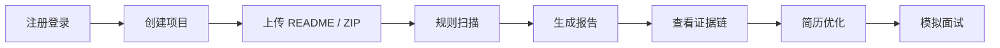

# ProjectMentor AI｜AI 项目真实性审计与面试深挖平台

ProjectMentor AI 是一个面向计算机学生和后端实习求职者的项目真实性审计工具，用于识别 README 夸大、AI 回答幻觉、简历风险和面试追问风险。

## 项目背景

越来越多学生会使用 AI 辅助做项目、写 README、整理简历和准备面试，但 AI 生成内容容易带来新的风险：

- README 描述比真实代码实现更“满”。
- 简历描述找不到对应代码、配置或运行证据。
- AI 评价过度鼓励，让用户高估项目成熟度。
- 面试被追问到具体实现时，容易解释不清。

ProjectMentor AI 的定位不是“让 AI 直接打分”，而是先做规则扫描和证据链整理，再用 AI 做表达增强和审计补充。AI 不可用时，系统仍然可以输出规则版报告。

## 核心功能

| 功能 | 状态 | 说明 |
| --- | --- | --- |
| 用户认证 | 已完成 | 支持注册、登录、JWT 鉴权、BCrypt 密码加密 |
| 项目管理 | 已完成 | 支持创建、列表、详情、删除项目 |
| README 保存 | 已完成 | 支持粘贴 README 并保存为项目文件 |
| ZIP 上传解析 | 已完成 | 支持普通项目 ZIP，最大 50MB，解析白名单文本文件并过滤无关目录 |
| 规则扫描 | 已完成 | 基于 README 与项目文件做风险识别 |
| 证据链 | 已完成 | 对关键结论关联文件、配置或代码证据 |
| 审计报告 | 已完成 | 输出评分、风险点、建议和简历改写版本，报告详情页支持浏览器打印 / 保存为 PDF |
| 只读报告分享 | 基础版 | 审计报告支持生成随机 Token 分享链接，公开页仅展示脱敏后的只读报告内容 |
| AI 增强报告 | 基础版 | 支持 OpenAI-compatible API；AI 不可用时降级为规则报告 |
| AI 幻觉检测 | 已完成 | 检测 AI 回答中的过度鼓励、缺少证据和简历风险 |
| 面试深挖 | 基础版 | 规则版 V1，支持会话、追问、评分、总结和面试复盘打印 / 保存为 PDF |
| 额度系统 | 已完成 | 注册赠送额度，报告生成消耗额度，失败返还并记录流水 |
| 异步任务 | 已完成 | 支持异步分析任务，Redis 缓存任务进度 |
| Docker 部署 | 已完成 | 支持 Docker Compose 启动 MySQL、Redis、后端、前端和 Nginx |

## 产品流程图



## 技术架构

| 层级 | 技术 |
| --- | --- |
| 后端 | Java 17, Spring Boot 3, MyBatis-Plus, MySQL 8, Redis, JWT, BCrypt, Validation, AOP, `@Async` |
| 前端 | Vue 3, Vite, TypeScript, Element Plus, Pinia, Vue Router, Axios, ECharts, markdown-it |
| 部署 | Docker Compose, Nginx, MySQL, Redis |
| AI | OpenAI-compatible API，可接 DeepSeek / 豆包 / OpenAI 风格接口 |

AI Key 未配置或调用失败时，系统会自动降级为规则版报告。

## 核心设计亮点

- 不直接相信 README：README 只是待验证材料，系统会结合上传文件做规则扫描。
- 不直接相信 AI 回答：AI 幻觉检测会识别过度鼓励、缺少证据和不适合写入简历的表述。
- 先规则扫描，再 AI 增强：规则扫描负责稳定输出，AI 负责补充表达与总结。
- 每个关键结论尽量带证据：通过文件类型、路径、配置和代码片段形成证据链。
- 用户数据按 `userId` 隔离：项目、任务、报告、额度和面试会话都按当前用户校验。
- ZIP 上传安全过滤：支持普通项目 ZIP，最大 50MB，自动过滤 `.git`、`target`、`node_modules`、`dist`、`build` 等目录，只解析核心文本文件。
- 异步任务避免接口阻塞：分析任务进入后台执行，前端轮询任务状态。
- 额度流水可追踪：当前只实现额度账户、消耗、返还和管理员加额，尚未接入支付系统。

## 项目结构

```text
projectmentor-ai
├── backend
│   └── projectmentor-server
├── frontend
│   └── projectmentor-web
├── deploy
│   └── nginx
└── docs
```

## 本地运行方式

后端：

1. 创建 MySQL 数据库 `projectmentor_ai`。
2. 执行初始化脚本：`backend/projectmentor-server/src/main/resources/db/init.sql`。
3. 配置环境变量，例如 `DB_HOST`、`DB_PORT`、`DB_USERNAME`、`DB_PASSWORD`、`JWT_SECRET`。
4. 启动后端：

```bash
cd backend/projectmentor-server
mvn spring-boot:run
```

前端：

```bash
cd frontend/projectmentor-web
npm install
npm run dev
```

默认本地访问：

- 后端健康检查：`http://localhost:8080/api/health`
- 前端开发服务：以 Vite 输出为准，通常为 `http://localhost:5173`

## Docker Compose 运行方式

```bash
cp .env.example .env
```

修改 `.env` 中的关键配置：

- `MYSQL_ROOT_PASSWORD`
- `JWT_SECRET`
- 可选：`AI_BASE_URL`、`AI_API_KEY`、`AI_MODEL`

启动：

```bash
docker compose up -d --build
```

访问：

```text
http://localhost
```

更完整的 Docker 说明见 [docs/deploy-docker.md](docs/deploy-docker.md)。

## Cloudflare Tunnel 临时试用

如果只是想把本机运行的项目临时发给同学试用，可以使用 Cloudflare Tunnel 暴露前端开发服务。该方式适合临时演示，不适合长期正式运营。

说明见 [docs/cloudflare-tunnel-demo.md](docs/cloudflare-tunnel-demo.md)。

## 环境变量说明

| 变量 | 说明 |
| --- | --- |
| `MYSQL_ROOT_PASSWORD` | MySQL root 密码，Docker Compose 启动时必填 |
| `JWT_SECRET` | JWT 签名密钥，请使用足够长的随机字符串 |
| `AI_BASE_URL` | OpenAI-compatible API 地址，例如 DeepSeek 或其他兼容接口 |
| `AI_API_KEY` | AI 服务密钥，可留空；留空时使用规则版报告 |
| `AI_MODEL` | AI 模型名称，例如 `deepseek-chat` |

不要提交真实 `.env` 文件或真实密钥。仓库中只保留 `.env.example`。

## API 模块概览

- `auth`：注册、登录、当前用户、退出登录。
- `projects`：项目创建、列表、详情、删除。
- `files`：README 保存、文件列表、文件详情、删除文件。
- `upload-zip`：上传项目 ZIP，自动过滤无关目录和二进制文件，并解析核心文本文件。
- `scan`：README 风险规则扫描与证据链生成。
- `reports`：生成审计报告、查看项目报告列表、查看报告详情。
- `share`：为审计报告生成、刷新、关闭只读分享链接，并通过随机分享 Token 访问脱敏公开报告。
- `analyze tasks`：启动异步分析任务、查询任务进度。
- `hallucination`：检测 AI 回答幻觉和简历风险。
- `interview`：启动模拟面试、提交回答、查看会话、结束面试。
- `credits`：查看额度、额度流水、管理员加额。

更完整的接口说明见 [docs/api-overview.md](docs/api-overview.md)。

## 演示流程

1. 注册新用户，系统赠送初始分析额度。
2. 登录后进入项目列表。
3. 创建项目，填写名称、技术栈和项目描述。
4. 上传普通项目 ZIP，系统自动过滤 `.git`、`target`、`node_modules`、`dist`、`build` 等目录，只解析 README、配置文件、Java 文件、SQL 文件等核心文本文件。
5. 执行规则扫描，查看 README 风险点和证据链。
6. 启动异步分析任务，等待报告生成。
7. 查看项目审计报告，包括评分、风险点、证据链、建议和简历写法。
8. 在报告详情页生成只读分享链接，复制后可在未登录窗口打开；分享页不暴露用户邮箱、用户 ID、AI Key、AI 调用日志、额度流水或原始项目源码内容。
9. 粘贴一段 AI 对项目的评价，执行 AI 幻觉检测。
10. 启动模拟面试，回答追问并查看反馈。

更完整的演示说明见 [docs/demo-guide.md](docs/demo-guide.md)。

## 简历与面试准备

📚 面试准备与简历写法：请参考 [docs/interview-preparation.md](docs/interview-preparation.md)。

## 当前限制

- AI Key 未配置时使用规则版报告，不会调用外部 AI 服务。
- 面试深挖当前是规则版 V1，追问逻辑还需要继续扩展。
- 尚未接入真实支付，当前只有额度账户和流水。
- ZIP 上传当前最大支持 50MB，会自动过滤常见依赖、构建和 IDE 目录，只解析核心文本文件，不保存二进制文件。
- 审计报告只读分享当前为基础版能力，不包含访问统计和密码保护。
- 还需要真实用户测试，用于调整规则、文案和演示流程。

## 后续路线

- V4.0：当前可试用版本。
- V4.1：PDF 导出 / 分享报告（已支持报告页和面试复盘浏览器打印 / 保存为 PDF，正式后端 PDF 导出可作为后续增强）。
- V4.2：RAG 项目问答。
- V4.3：管理员后台 / 用户反馈。
- V4.4：更正式的部署和用户体系。

详细路线见 [docs/roadmap.md](docs/roadmap.md)。

## 更多文档

- [项目架构说明](docs/project-architecture.md)
- [API 概览](docs/api-overview.md)
- [演示指南](docs/demo-guide.md)
- [Docker 部署说明](docs/deploy-docker.md)
- [Cloudflare Tunnel 临时试用](docs/cloudflare-tunnel-demo.md)
- [面试准备与简历写法](docs/interview-preparation.md)
- [Roadmap](docs/roadmap.md)
