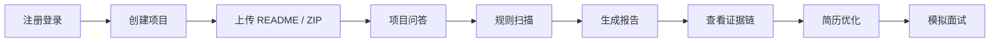

# ProjectMentor AI｜项目真实性审计与面试深挖平台

ProjectMentor AI 是一个项目真实性审计与面试深挖平台，基于代码证据链、规则扫描和 AI 深度解读，帮助开发者检查项目描述是否夸大、代码证据是否支撑、简历表达是否稳妥，以及面试中可能被怎样追问。

ProjectMentor AI is a project authenticity audit and interview deep-dive platform. It uses code evidence chains, rule-based scanning, and AI deep review to help developers verify project claims, improve resume wording, and prepare for technical interviews.

PMAI 的目标不是替用户“包装项目”，而是帮助用户基于真实证据讲清楚自己的项目。

## Public Preview / 公开内测

当前状态：**Public Preview / 内测中**。

核心能力：

- Project authenticity audit；
- Claim-Evidence Matrix；
- AI deep review；
- Interview deep-dive；
- Credits cost control；
- Admin AI usage dashboard。

使用提醒：

- 请勿上传敏感密钥、Token、密码、真实商业机密或公司内部代码；
- AI 结果仅供学习、复盘和面试准备参考，不是官方认证；
- PMAI 帮助用户更真实、更稳妥地表达项目，不鼓励包装或夸大项目经历；
- 规则证据链扫描免费，AI 功能按现有规则消耗 credits，失败时按系统规则返还。

隐私与使用边界见 [docs/privacy-and-disclaimer.md](docs/privacy-and-disclaimer.md)。

## 版权与使用边界

ProjectMentor AI（PMAI）由李鑫哲独立设计、开发并上线。Copyright © 2026 李鑫哲. All rights reserved.

本项目当前公开仓库主要用于：

- 个人作品展示；
- 学习交流；
- 受邀体验；
- 技术讨论；
- 面试与项目复盘展示。

允许查看源代码、为评审或讨论目的在 GitHub Fork、提交 Issue 或建议，以及在清晰注明作者与项目来源的前提下引用本项目。

未经作者书面许可，不得：

- 将本项目代码或核心设计复制、转售、再许可或二次发布；
- 将本项目部署为公开或商业服务；
- 将本项目包装为课程作业、竞赛项目、机构项目、课题成果或商业产品；
- 删除或隐藏原作者信息，或声称拥有本项目及其核心产品概念的作者身份；
- 将项目文档、页面截图、交互流程、UI 设计或核心产品概念用于高度相似产品的公开发布。

如需教学、研究、团队协作、机构使用或商业使用，请提前联系作者并取得书面许可。完整条款见根目录 [LICENSE](LICENSE)。

本项目当前采用自定义 **Source-Available / All Rights Reserved** 声明，不是 MIT、Apache、GPL 或其他标准开源许可证授权的开源项目。后续如决定正式开源，将重新评估 AGPL、Apache、MIT 等许可证。

## 项目背景

越来越多计算机学生、实习求职者和早期开发者会使用 AI 辅助做项目、写 README、整理简历和准备面试，但 AI 生成内容容易带来新的风险：

- README 描述比真实代码实现更“满”。
- 简历描述找不到对应代码、配置或运行证据。
- AI 评价过度鼓励，让用户高估项目成熟度。
- 面试被追问到具体实现时，容易解释不清。

ProjectMentor AI 的定位不是“让 AI 直接打分”，而是先做规则扫描和证据链整理，再用 AI 做表达增强和审计补充。AI 不可用时，系统仍然可以输出规则版报告。

## 当前公开预览版本：V4.8-1

V4.8-1 是“注册邮箱验证码线上验收与部署配置固化”版本：注册邮箱验证码已上线，线上 Foxmail / QQ SMTP 发码已验证成功；生产环境需要配置 SMTP 并设置 `EMAIL_VERIFICATION_ENABLED=true`。`docker-compose.yml` 已让 backend 通过 `env_file: .env` 读取部署环境变量；真实 `.env` 不提交，`.env.example` 只保留示例。本版本不新增数据库表，不改变 credits 扣费、登录 JWT、管理员权限或 AI 调用逻辑。

PMAI 当前核心架构可以概括为：

```text
规则证据链（免费）
  + AI 深度增强（消耗 credits，失败返还）
  + credits 成本控制
  + 管理员后台与使用统计
```

Claim-Evidence 的核心价值，是把项目描述拆成可核对的主张，再逐条判断是否有代码、配置、SQL 或部署证据支撑。`DOC_ONLY`、`NO_EVIDENCE`、`RISKY` 内容不建议未经修改直接写进简历。

当前版本已经完成 ProjectMentor AI 的核心闭环：

- 项目创建与管理；
- README 保存；
- 大项目 ZIP 上传解析，最大 800MB；
- 规则扫描与证据链；
- Claim-Evidence 主张—证据链审计矩阵；
- AI 增强审计报告，AI 不可用时降级为规则报告；
- AI 幻觉检测；
- 项目问答；
- 模拟面试与复盘；
- 我的报告与面试记录；
- Dashboard 真实数据统计；
- 额度账户与额度流水；
- 注册邮箱验证码；
- 管理员后台、AI 使用统计、额度发放 / 扣除与反馈管理；
- 中文 / English 国际化；
- Docker Compose + Nginx 部署；
- MySQL 备份、恢复和线上检查脚本；
- Nginx 敏感路径拦截；
- Source-Available / All Rights Reserved 使用边界。

当前边界：

- 当前不是企业级代码审计平台；
- 当前不是商业安全审计系统；
- 当前不承诺 AI 结论完全准确；
- 当前未接入真实支付系统；
- 当前项目问答仍是轻量证据检索增强，不是成熟向量数据库 RAG；
- 当前主要用于学习、项目复盘、简历表达检查和答辩 / 面试准备。

完整已知边界见：[docs/known-limitations.md](docs/known-limitations.md)。

版本说明见：[docs/release-notes.md](docs/release-notes.md)。

## 适合人群与项目范围

PMAI 面向需要验证项目真实性的开发者，适用人群包括计算机专业学生、实习求职者和早期开发者，可用于学习、项目复盘、简历表达检查和面试准备。

当前可用于复盘前端、后端、全栈、AI 应用、数据分析、课程项目、竞赛项目以及嵌入式 / 硬件相关项目的公开文本与源码证据。不同技术方向的规则覆盖程度可能不同，AI 结论仅供参考，关键判断应回到代码、配置、部署文件和实际项目证据。

## 核心功能

| 功能 | 状态 | 说明 |
| --- | --- | --- |
| 用户认证 | 已完成 | 支持注册、登录、JWT 鉴权、BCrypt 密码加密；注册邮箱验证码已上线，验证码通过 SMTP 发送；生产环境需要配置 SMTP 并设置 `EMAIL_VERIFICATION_ENABLED=true`，默认可通过 `EMAIL_VERIFICATION_ENABLED=false` 关闭强制校验；同 IP 每小时最多成功注册 3 个账号、每天最多 10 个账号 |
| 项目管理 | 已完成 | 支持创建、列表、详情、删除项目 |
| README 保存 | 已完成 | 支持粘贴 README 并保存为项目文件 |
| ZIP 上传解析 | 已完成 | 支持普通项目 ZIP，最大 800MB，解析源码核心文本并过滤依赖、构建、缓存、二进制和超大文件；文件结果支持分页、路径搜索和基础类型筛选 |
| 规则扫描 | 已完成 | 基于 README 与项目文件做风险识别 |
| 证据链 | 已完成 | 对关键结论关联文件、配置或代码证据 |
| Claim-Evidence 审计 | V4.5-2 | 从项目描述、技术栈和 README 抽取主张，逐条标记 `SUPPORTED` / `PARTIAL` / `DOC_ONLY` / `NO_EVIDENCE` / `RISKY` 并关联脱敏文件证据；可选 AI 深度解读会基于已生成矩阵补充解释、简历表达和面试追问 |
| 审计报告 | 已完成 | 输出评分、风险点、建议和三版证据化简历描述，已支持报告详情页浏览器打印 / 另存为 PDF |
| 只读报告分享 | 已支持 | 审计报告已支持生成随机 Token 只读分享链接，公开页仅展示脱敏后的报告内容 |
| AI 增强报告 | 基础版 | 支持 OpenAI-compatible API；AI 不可用时降级为规则报告 |
| AI 幻觉检测 | 已完成 | 检测 AI 回答中的过度鼓励、缺少证据和简历风险 |
| 项目问答 | MVP | V4.2-4 支持轻量检索增强问答、历史记录、证据可信度、面试讲法、简历风险提示、面试版复制、关键词扩展、文件权重和检索解释，不接入向量数据库 |
| 面试深挖 | 基础版 | 支持会话、证据约束追问、问题列表、进度、跳过、结束复盘、评分总结和浏览器打印 / 另存为 PDF |
| 额度系统 | 已完成 | 注册赠送 10 credits；规则扫描和历史查看不扣额度，调用 AI 的功能按统一成本扣减，失败返还并记录流水 |
| 管理员后台 | V4.5-4 | 支持 AI 使用统计、用户额度分页、额度流水、管理员发放 / 扣除和反馈管理，通过 `ADMIN_EMAILS` 配置管理员邮箱，不引入复杂 RBAC |
| 国际化与视觉升级 | 已完成 | V4.4-0 支持中文 / English 切换、localStorage 持久化、首页 / 控制台 / 问答 / 后台视觉升级和轻量 CSS 动效 |
| 体验与演示优化 | V4.5-5 | 优化 Landing、新手引导、项目创建说明、报告解读、Claim-Evidence 状态解释、Credits 费用说明、空状态、管理员视觉和八步演示路径 |
| 作者支持入口 | 轻量版 | “请作者喝咖啡”仅展示本地二维码，自愿支持，不影响任何功能使用，不是支付系统 |
| 反馈入口 | 已完成 | 登录用户可站内提交反馈，管理员可筛选和更新反馈状态；保留 GitHub Issues 作为备用入口，不做复杂工单系统 |
| 异步任务 | 已完成 | 支持异步分析任务，Redis 缓存任务进度 |
| Docker 部署 | 已完成 | 支持 Docker Compose 启动 MySQL、Redis、后端、前端和 Nginx |
| 线上备份与恢复 | 已完成 | V4.4-1 提供 MySQL 备份、恢复和线上状态检查脚本，便于服务器迁移和故障排查 |
| Nginx 安全收口 | 已完成 | V4.4-1.1 拦截 `.env`、SQL 备份、调试入口和常见扫描路径，减少公网扫描噪音 |

## 产品流程图



推荐演示路径：

1. 创建项目。
2. 粘贴 README 或上传 ZIP。
3. 查看免费规则扫描。
4. 生成 AI 审计报告。
5. 查看 Claim-Evidence 矩阵。
6. 点击 AI 深度解读。
7. 进入模拟面试。
8. 公开分享只读报告。

## 技术架构

| 层级 | 技术 |
| --- | --- |
| 后端 | Java 17, Spring Boot 3, MyBatis-Plus, MySQL 8, Redis, JWT, BCrypt, Validation, AOP, `@Async` |
| 前端 | Vue 3, Vite, TypeScript, Element Plus, Pinia, Vue Router, vue-i18n, Axios, ECharts, markdown-it |
| 部署 | Docker Compose, Nginx, MySQL, Redis |
| AI | OpenAI-compatible API，可接 DeepSeek / 豆包 / OpenAI 风格接口 |

AI Key 未配置或调用失败时，系统会自动降级为规则版报告。

## 核心设计亮点

- 不直接相信 README：README 只是待验证材料，系统会结合上传文件做规则扫描。
- 不直接相信 AI 回答：AI 幻觉检测会识别过度鼓励、缺少证据和不适合写入简历的表述。
- 先规则扫描，再 AI 增强：规则扫描负责稳定输出，AI 负责补充表达与总结。
- 项目问答仍是轻量 MVP：只基于已保存文件做关键词扩展、文件权重打分、证据片段抽取和证据充分度评估，不接入 Milvus、向量数据库或 embedding。
- 每个关键结论尽量带证据：通过文件类型、路径、配置和代码片段形成证据链。
- V4.4-0.5 基于真实用户反馈优化：项目详情文件列表支持分页、路径搜索和 CODE / CONFIG / DOC / OTHER 筛选，避免长列表撑满页面。
- V4.4-0.5 优化模拟面试：默认最多 8 个核心问题，按项目真实性、技术实现、证据解释、简历风险和压力追问组织，并展示问题列表、进度、跳过和结束复盘。
- V4.4-0.5 强化证据约束：面试问题会返回证据强度和关联文件；证据不足时使用克制表达，不把 README 或配置描述包装成确定性代码实现。
- V4.4-0.5 增强简历描述：三版文案都包含推荐使用场景、描述、风险提示、可被追问点和证据来源，报告页支持复制单版内容。
- 用户数据按 `userId` 隔离：项目、任务、报告、额度和面试会话都按当前用户校验。
- ZIP 上传安全过滤：支持普通项目 ZIP，最大 800MB，自动过滤 `.git`、`target`、`node_modules`、`dist`、`build`、`coverage`、`.next`、`.nuxt`、`vendor`、`__pycache__`、`.cache`、`.gradle`、`uploads`、`tmp` 等无价值目录；单个文本文件最多解析 2MB，最多保存 8000 个有效文件，累计有效处理大小最多 1GB。
- 异步任务避免接口阻塞：分析任务进入后台执行，前端轮询任务状态。
- 额度流水可追踪：额度账户记录 AI 消耗、失败返还和管理员调整，尚未接入支付系统。
- 管理员后台保持克制边界：通过环境变量配置管理员邮箱，可查看 AI 使用统计、用户余额和流水，也可发放 / 扣除额度、筛选反馈和更新反馈状态；所有额度调整必须写入流水，不返回密码、密钥或项目源码内容。
- 试用边界明确：首页和登录后 Dashboard 均提示不要上传真实商业机密、真实密钥或公司内部代码，AI 结论仅供学习、项目复盘和面试准备参考。
- V4.4-0 增加基础国际化：前端支持 `zh-CN` 与 `en-US`，语言选择持久化到 localStorage；没有保存值时会根据浏览器语言判断，默认中文。
- V4.4-0 优化产品视觉：Landing、Dashboard、Project Q&A 和 Admin Dashboard 更接近正式 AI SaaS 产品体验；动效仅使用轻量 CSS，不引入复杂动画依赖。

## V4.1-10 首页、支持与反馈

V4.1-10 主要做产品体验收口，不新增数据库表，不修改核心审计逻辑，不接入真实支付接口：

- 首页补充产品定位、适合人群、核心流程、当前试用能力和试用版边界。
- 首页和登录后 Header 提供“请作者喝咖啡”入口，仅展示 `/donate/wechat.png` 与 `/donate/alipay.png` 两个本地二维码路径。
- “请作者喝咖啡”是完全自愿支持，不影响任何功能使用，不是支付系统。
- 首页和登录后 Header 提供反馈入口；V4.3-3 已升级为站内提交，并保留复制模板和 GitHub Issues 备用入口。
- 真实收款码图片不提交到 GitHub；本地部署时可在 `frontend/projectmentor-web/public/donate/` 下放置 `wechat.png` 和 `alipay.png`。
- `frontend/projectmentor-web/public/donate/README.md` 可以提交，用于说明本地二维码文件放置方式。

## V4.2 项目问答 MVP

V4.2-1 增加项目详情页的“项目问答”入口，用于围绕当前项目已上传的 README 和 ZIP 解析文本提问。

- 当前不是成熟向量 RAG，不接入 Milvus，不做 embedding，只做轻量关键词检索增强问答。
- 后端会先按当前登录用户校验项目归属，再检索该项目自己的 `pm_project_file` 文件内容。
- 回答会返回文件路径、命中原因和 500 字以内的证据片段。
- AI 可用时，回答必须基于证据组织；证据不足时要明确提示。
- AI 关闭、Key 缺失、调用失败或超时时，接口会返回规则检索到的证据片段，不直接编造答案。
- 新增问答记录表 `pm_project_qa_record`，用于保存问题、回答、AI 是否使用、证据 JSON 和建议追问 JSON。
- 已有数据库需要手动执行 `backend/projectmentor-server/src/main/resources/db/init.sql` 中的 `pm_project_qa_record` 建表 SQL。

V4.2-2 补齐项目问答体验闭环：

- 新增最近问答历史查询，默认返回最近 20 条，按创建时间倒序，问答记录仅用户本人可见。
- 支持逻辑删除自己的某条问答记录，删除校验同时包含 `userId + projectId + recordId`。
- 提问成功后自动刷新历史，清空输入框，并把本次回答展示在顶部。
- 建议追问和快捷问题都以按钮形式填入输入框，避免误触发 AI 调用。
- 每条回答支持复制，复制内容包含问题、回答、证据文件路径和建议追问。
- 证据片段默认收起为 3 到 5 行，可展开或收起，避免长片段撑爆页面。
- AI 不可用时继续展示规则检索结果，并明确提示这不是完整结论。
- 无证据时提示用户先保存 README、上传项目 ZIP，或把问题问得更具体。

V4.2-3 增加项目问答可信度和面试复盘输出：

- 每次回答返回证据可信度等级：强证据、中等证据、弱证据或证据不足。
- `confidenceScore` 表示基于当前上传文件的证据充分度，不代表 AI 回答的绝对正确率。
- 后端根据证据数量、内容命中、路径命中、README / 配置 / 代码文件角色生成证据摘要。
- 新增面试讲法，帮助用户把回答转成真实、克制、可追问的表达。
- 新增简历风险提示，证据不足时不建议写进简历或过度包装。
- 支持一键复制面试版回答，内容包含问题、证据可信度、面试讲法、简历风险、关键证据文件和建议追问。
- 历史记录不新增数据库字段，会基于已保存的证据 JSON 动态计算可信度和复盘字段。

V4.2-4 优化项目问答检索质量和稳定性：

- 增强中文问题、英文技术词、camelCase、snake_case、kebab-case 的关键词提取，并增加登录鉴权、Redis / 缓存、上传、报告、AI、异步、部署、额度等轻量同义词映射。
- 优化 Controller、Service、Config、Interceptor、Filter、Util、Mapper、Entity、DTO / VO、配置文件、部署文件、SQL 和 README 的文件角色权重。
- 降低锁文件、构建产物、压缩产物、大型样式文件和日志类文件的误命中影响，避免 README 或巨大文件因为重复词过多压过真实代码证据。
- 证据 snippet 优先截取关键词、类名、方法名或配置块附近内容，并控制长度，便于用户复盘真实代码证据。
- 命中原因会解释文件路径、内容关键词、技术词和文件角色为什么相关，前端支持复制证据文件路径。
- `confidenceScore` 仍表示证据充分度，不是 AI 正确率；证据较弱时不建议过度写进简历。
- 后续 V4.2-5 或 V4.3 可在反馈足够后评估向量检索升级或管理员后台。

## V4.3-3 站内反馈管理

V4.3-3 在原轻量反馈入口基础上补齐站内提交和管理员处理闭环：

- 新增 `pm_feedback` 表，保存登录用户提交的反馈类型、内容、联系方式、来源页面、状态和管理员备注。
- 登录用户可通过首页或登录后 Header 的“反馈”弹窗提交站内反馈；未登录提交会提示先登录。
- 管理员后台新增“反馈管理”区域，可按类型、状态和关键词筛选反馈，查看详情并更新状态为待处理、处理中、已解决或暂不处理。
- 管理员反馈接口位于 `/api/admin/feedback/**`，继续复用 `ADMIN_EMAILS`、`AuthInterceptor` 和 `AdminInterceptor`。
- 该能力不是复杂工单系统，不做邮件通知、客服聊天、删除反馈或用户数据导出。
- 已有线上数据库不会自动重放 `init.sql`，需要手动执行 `pm_feedback` 建表 SQL。

## V4.4-0 国际化与产品视觉升级

V4.4-0 聚焦公开测试展示和常见用户路径，不修改数据库结构，不修改后端核心业务逻辑：

- 前端新增 `vue-i18n` 基础国际化能力，支持 `zh-CN` 与 `en-US`。
- 语言切换入口位于首页右上角、登录后 Header、登录 / 注册页和公开分享页右上角。
- 语言设置写入 `localStorage`，刷新后保持；没有保存值时优先根据浏览器语言判断。
- 主要覆盖 Landing、登录、注册、Header、Sidebar、Dashboard、项目列表、创建项目、项目详情、报告详情、公开分享报告、模拟面试、AI 幻觉检测、项目问答、反馈弹窗、赞助弹窗和管理员后台主要区块。
- Landing 首页强化 Hero、CTA、核心卖点、试用提示和玻璃感功能卡片，更适合中英文公开测试展示。
- Dashboard 统一欢迎区、统计卡片和功能入口卡片；Project Q&A 强化输入区、快捷问题、证据可信度和证据列表；Admin Dashboard 优化统计卡、额度管理和反馈管理分组。
- 动效使用 `animations.css` 中的页面渐入、卡片 hover、按钮 hover glow、背景光幕慢速漂移和功能卡片 stagger animation，不新增大型动画库。
- 当前仍是 Beta 测试版，英文版用于更友好的公开测试展示；AI 输出仍仅供学习、项目复盘和面试准备参考。

## V4.4-0.5 真实用户反馈修复

V4.4-0.5 基于真实用户测试反馈做可用性和证据边界优化，不改数据库结构，不改额度系统，不改登录、后台权限或 AI Key 配置：

- 项目详情页的已保存文件、已跳过文件和项目文件列表支持前端分页，页大小为 20 / 50 / 100。
- 文件列表支持按路径关键词搜索，并按 CODE / CONFIG / DOC / OTHER 基础类型筛选。
- 模拟面试新增问题列表、当前进度、已回答 / 未回答 / 已跳过状态、跳过本题和结束面试并生成复盘。
- 面试默认最多 8 个核心问题，不无限追问；结束后不再继续生成新问题。
- 面试问题增强证据约束，返回 evidenceStrength、sourceFile 和 reason；没有代码证据时不会确定性追问过细实现。
- 简历描述生成逻辑更基于证据，三版文案都包含推荐使用场景、风险提示、可被追问点和证据来源。
- 报告页简历描述区域支持复制某一版内容，并在证据不足或存在风险边界时给出克制提示。

## V4.4-1.1 Nginx 敏感路径拦截

V4.4-1.1 在 Nginx 层拦截明显公网扫描路径，用于减少日志噪音和误访问风险，不替代后端鉴权：

- 拦截 `.env`、`env.json`、`runtime-env.json`、`assets/env.json`、`static/env.json`、`static/config.json`。
- 拦截 `.sql`、`.dump`、`.bak`、`.backup`、`.tar`、`.tar.gz`、`.tgz`、`.gz`、`.zip`、`.7z`、`.rar` 等备份或压缩文件请求。
- 拦截 `/@fs/`、`/__better_errors`、`/_debug`、`/trace.axd`、`/swagger`、`/swagger-ui`、`/v2/api-docs`、`/v3/api-docs`、`/actuator`、`/graphql`、`/v2/graphql`、`/api/install` 等调试或探测路径。
- 拦截包含 `/shell`、`wget`、`chmod`、`rm+-rf`、`GponForm`、`geoserver` 的明显扫描请求。
- 保留 `/api/**` 后端代理、前端路由 fallback、`/share/**`、`/assets/**` 和 `/donate/**` 正常访问。

## V4.4-2 大项目上传与源码核心包

V4.4-2 优化大项目上传和自查体验，不修改 AI / 额度逻辑，不新增 AI 调用，不绕过现有 ZIP 安全校验：

- ZIP 业务上传上限调整为 800MB；Nginx `client_max_body_size` 调整为 820m；Spring Multipart 文件和请求限制均调整为 820MB。
- 前端 ZIP 上传 timeout 调整为 `1200000ms`，并提示大项目上传可能需要数分钟。
- 项目描述上限调整为 10000 字符，技术栈上限调整为 5000 字符；创建项目表单同步显示字数统计。
- ZIP 解析会跳过依赖目录、构建产物、缓存目录、二进制文件、压缩包、模型/大数据文件和超大文本文件。
- skippedFiles reason 统一为 `ignored_directory`、`unsupported_type`、`file_too_large`、`unsafe_path`、`max_file_count_exceeded`、`max_total_size_exceeded`、`empty_file`、`binary_file`。
- 数据库初始化脚本中 `pm_project.description` 与 `pm_project.tech_stack` 均使用 `TEXT`。线上已有库如仍为旧字段长度，可执行：

```sql
ALTER TABLE pm_project MODIFY COLUMN description TEXT NULL COMMENT '项目描述';
ALTER TABLE pm_project MODIFY COLUMN tech_stack TEXT NULL COMMENT '技术栈';
```

## V4.5-1 Claim-Evidence 主张—证据链审计引擎

V4.5-1 在原有 README 风险扫描和文件证据链基础上增加逐条主张审计：

- 从项目描述、技术栈和 README 中按规则抽取最多 30 条项目主张。
- 将主张分类到鉴权、数据库、缓存、AI、项目问答、上传、报告、面试、管理员、额度、部署、前端、安全、性能和产品等方向。
- 匹配 Java、Vue、配置、SQL、Docker、Nginx 和部署脚本等强证据，并区分 README / docs 等弱证据。
- 每条主张标记为 `SUPPORTED`、`PARTIAL`、`DOC_ONLY`、`NO_EVIDENCE` 或 `RISKY`。
- 报告详情和只读分享页展示 Claim-Evidence Matrix，支持状态筛选、证据展开和复制面试解释。
- 证据 snippet 最长 300 字，并对 password、secret、token、API Key、JWT 等疑似敏感值做脱敏。

当前 Claim extraction 和证据匹配均为规则版，不新增 AI 调用，不接入向量数据库，也不是法律、学术或权威意义上的真实性鉴定。状态结果不保证 100% 准确，应结合实际项目证据人工复核，主要用于学习、项目复盘、简历表达检查和面试准备。

## V4.5-2 AI Claim-Evidence 增强与额度收口

V4.5-2 在不改变规则扫描基础层的前提下，为报告详情页增加“AI 深度解读主张证据矩阵”能力：

- 新用户注册默认赠送 10 credits，并继续记录 `REGISTER_GIFT` 额度流水。
- 新增统一 AI 扣费常量，`AI_CLAIM_EVIDENCE = 2`；规则扫描、上传解析、历史查看、Dashboard 浏览等不调用 AI 的功能不扣额度。
- 报告详情页可点击“AI 深度解读主张证据矩阵”，确认后调用 `/api/reports/{reportId}/claim-evidence/ai-enhance`，消耗 2 credits。
- AI 只接收已结构化的 Claim-Evidence 数据，最多优先分析 15 条风险更高的 claim；不会重新扫描仓库，不保存完整 Prompt，不返回完整源码。
- AI 调用或保存失败会返还 2 credits，并写入 `AI_CLAIM_EVIDENCE_REFUND` 流水。
- AI 增强结果写回 `pm_analysis_report.claim_evidence` JSON 的顶层字段，例如 `aiEnhanced`、`aiSummary`、`aiRiskOverview`、`aiResumeStrategy`、`aiInterviewStrategy` 和 `aiEnhancedItems`，不新增数据库字段。
- 私有报告页和公开分享页都能展示已保存的 AI 增强内容；公开页不展示用户额度、内部错误、AI 调用日志或完整源码。

这个增强不是替用户包装项目，而是基于已有证据给出更稳妥的解释、简历表达和面试准备方向。`DOC_ONLY`、`NO_EVIDENCE`、`RISKY` 的主张仍应保守表达。

## V4.5-3 全量 AI 功能额度扣减收口

V4.5-3 将所有真实调用 OpenAI-compatible LLM API 的入口统一到同一套预扣、失败退款和流水规则：

| 功能 | 额度 |
| --- | ---: |
| AI 审计报告 | 2 credits |
| AI Claim-Evidence 深度解读 | 2 credits |
| AI 项目问答 | 1 credit / 次 |
| AI 幻觉检测 | 1 credit / 次 |
| AI 模拟面试 | 2 credits / 场 |
| 独立 AI 简历优化（预留标准） | 1 credit / 次 |

- 新用户注册赠送 10 credits。
- AI 调用前检查并预扣额度；额度不足时不会调用 LLM。
- AI 调用失败、返回无法使用或业务结果保存失败时返还额度，并写入对应 `*_REFUND` 流水。
- 项目问答、幻觉检测和模拟面试保留规则 fallback；fallback 未使用 AI 时不扣费，AI 失败转 fallback 时自动退款。
- 规则扫描、Claim-Evidence 基础矩阵、README / ZIP 上传解析、项目管理、Dashboard、历史查看、公开分享和管理员反馈继续免费。
- 报告内附带的简历建议属于 AI 审计报告结果，不重复收取 `AI_RESUME_OPTIMIZE`。
- 本轮不新增数据库字段、AI Provider 或依赖，也不修改 `.env.development`。

## V4.5-4 AI 成本监控、管理员额度管理与注册防刷

V4.5-4 继续复用 `pm_user_plan` 与 `pm_credit_log`，不新增数据库表：

- 新增 `/api/admin/credits/users` 分页查询，支持用户名 / 邮箱搜索和余额、注册时间、最近额度变化排序。
- 新增用户额度流水分页接口，并支持 `type`、`module`、`startTime`、`endTime` 筛选。
- 新增 `/api/admin/credits/users/{userId}/grant` 与 `/deduct`；管理员发放写入 `ADMIN_GRANT`，扣除写入 `ADMIN_DEDUCT`，余额不允许变为负数。
- 新增 `/api/admin/ai-usage/overview`，基于现有流水统计今日 / 累计 AI 调用、消耗、退款、模块排行、用户排行和最近 AI 流水。
- 管理员前端新增 AI 使用统计面板、完整额度管理和流水弹窗，发放、扣除及反馈状态更新均有确认提示，并支持中英文文案。
- 注册赠送仍为 10 credits；同 IP 每小时最多成功注册 3 个账号、每天最多 10 个账号。
- 注册限流优先使用 Redis，并保留进程内计数降级；Redis 不可用时不会导致注册服务崩溃。
- 规则扫描、上传解析、项目管理、Dashboard、历史查看和公开分享仍然免费。
- 本轮不接入支付系统、不新增第三方依赖、不新增数据库表，也不修改 `.env.development` 或 LICENSE。

## 如何用 PMAI 自查 PMAI 自己？

不建议直接压缩整个项目根目录。PMAI 自身项目完整压缩包可能包含 `node_modules`、`target`、`dist`、`.git`、构建产物和缓存，体积很容易膨胀，也会稀释真正有价值的源码证据。

建议先制作“源码核心包”：删除或排除 `node_modules`、`target`、`dist`、`build`、`.git`、`logs`、`coverage` 和临时文件；保留 `backend`、`frontend/src`、`frontend/package.json`、`README.md`、`docs`、`docker-compose.yml`、`Dockerfile`、`deploy/nginx`、SQL、配置示例等材料。PMAI 审计重点是源码、配置、README、部署文件和证据链，不是依赖包和构建产物。

如果完整包超过 800MB，请先制作源码核心包再上传。系统会自动跳过无意义目录和超大文件，但提前清理能显著减少上传时间。

## 项目结构

```text
projectmentor-ai
├── backend
│   └── projectmentor-server
├── frontend
│   └── projectmentor-web
├── deploy
│   └── nginx
├── docs
└── scripts
```

## 本地运行方式

后端：

1. 创建 MySQL 数据库 `projectmentor_ai`。
2. 执行初始化脚本：`backend/projectmentor-server/src/main/resources/db/init.sql`。
3. 配置环境变量，例如 `DB_HOST`、`DB_PORT`、`DB_USERNAME`、`DB_PASSWORD`、`JWT_SECRET`。
4. 启动后端：

```bash
cd backend/projectmentor-server
mvn spring-boot:run
```

前端：

```bash
cd frontend/projectmentor-web
npm install
npm run dev
```

默认本地访问：

- 后端健康检查：`http://localhost:8080/api/health`
- 前端开发服务：以 Vite 输出为准，通常为 `http://localhost:5173`

## Docker Compose 运行方式

```bash
cp .env.example .env
```

修改 `.env` 中的关键配置：

- `MYSQL_ROOT_PASSWORD`
- `JWT_SECRET`
- 生产邮箱验证码：`EMAIL_VERIFICATION_ENABLED=true`、`MAIL_HOST`、`MAIL_PORT`、`MAIL_USERNAME`、`MAIL_PASSWORD`、`MAIL_FROM`
- 可选：`AI_BASE_URL`、`AI_API_KEY`、`AI_MODEL`

启动：

```bash
docker compose up -d --build
```

说明：上述命令保留用于本地或资源充足环境的完整 Compose 构建启动。2 核 2G 轻量服务器可以运行项目，但不适合每次在服务器上构建前端或后端；不建议在服务器执行 `docker compose build frontend`、`docker compose up -d --build`、`npm run build` 或 `mvn clean package`。前端更新推荐在本地构建 `dist`，压缩后上传服务器覆盖静态文件；后端更新推荐在本地构建 jar 后上传服务器。

访问：

```text
http://localhost
```

更完整的 Docker 说明见 [docs/deploy-docker.md](docs/deploy-docker.md)。

## 线上备份、恢复与状态检查

服务器日常备份 MySQL：

```bash
cd /opt/projectmentor-ai
bash scripts/backup-mysql.sh
```

备份文件会输出到 `backups/mysql/`，文件名形如 `pmai_mysql_20260603_223000.sql`。`backups/` 和 `*.sql` 已被 `.gitignore` 忽略，不要提交备份文件。

从指定 SQL 文件恢复 MySQL：

```bash
cd /opt/projectmentor-ai
bash scripts/restore-mysql.sh backups/mysql/xxx.sql
```

恢复脚本会提示风险，并要求输入 `YES` 后才继续。恢复前请先确认已经备份当前数据库。

线上状态检查：

```bash
cd /opt/projectmentor-ai
bash scripts/check-prod.sh
```

该脚本只读输出当前时间、Git commit、`docker compose ps`、核心容器状态、磁盘、内存、`docker stats`、backend 最近日志和 nginx 最近日志，适合复制给排查问题使用。

迁移服务器时至少需要带走：

- MySQL SQL 备份。
- `.env`。
- `frontend/projectmentor-web/public/donate/wechat.png`。
- `frontend/projectmentor-web/public/donate/alipay.png`。
- `docker-compose.yml`。
- `docker-compose.fast.yml`。
- `deploy/nginx/nginx.conf`。
- 后端 jar 可重新本地构建。
- 前端 `dist.zip` 可重新本地构建。

完整迁移流程见 [docs/server-deploy-vps.md](docs/server-deploy-vps.md)。

## 轻量服务器更新建议

前端轻量更新流程：

本地 Windows PowerShell：

```powershell
cd C:\Users\LiXin\Desktop\projectmentor-ai\frontend\projectmentor-web
npm.cmd run build
Remove-Item -Force dist.zip -ErrorAction SilentlyContinue
Compress-Archive -Path dist* -DestinationPath dist.zip -Force
scp dist.zip root@服务器IP:/opt/projectmentor-ai/frontend-dist.zip
```

服务器：

```bash
cd /opt/projectmentor-ai
rm -rf /tmp/projectmentor-frontend-dist
mkdir -p /tmp/projectmentor-frontend-dist
unzip -o frontend-dist.zip -d /tmp/projectmentor-frontend-dist
docker exec projectmentor-frontend-assets sh -c "rm -rf /usr/share/nginx/html/*"
docker cp /tmp/projectmentor-frontend-dist/. projectmentor-frontend-assets:/usr/share/nginx/html/
docker compose restart frontend nginx
docker compose ps
```

后端快速部署流程：

本地 Windows PowerShell 构建固定 jar：

```powershell
cd C:\Users\LiXin\Desktop\projectmentor-ai\backend\projectmentor-server
mvn clean package -DskipTests

$jar = Get-ChildItem .\target\*.jar | Where-Object { $_.Name -notlike "*sources*" -and $_.Name -notlike "*javadoc*" -and $_.Name -notlike "*.original" } | Select-Object -First 1
Copy-Item $jar.FullName .\target\projectmentor-server.jar -Force
scp target\projectmentor-server.jar root@服务器IP:/opt/projectmentor-ai/backend/projectmentor-server/target/projectmentor-server.jar
```

服务器快速构建并重启 backend：

```bash
cd /opt/projectmentor-ai
git pull
mkdir -p backend/projectmentor-server/target
ls -lh backend/projectmentor-server/target/projectmentor-server.jar
docker compose -f docker-compose.yml -f docker-compose.fast.yml build backend
docker compose up -d backend
docker compose logs --tail=120 backend
docker compose ps
```

快速方案使用 `Dockerfile.fast`，只复制本地构建好的 `target/projectmentor-server.jar`，不会在服务器内执行 Maven 或下载依赖。原完整构建方案仍保留：

```bash
docker compose build backend
docker compose up -d backend
```

不要提交 `backend/projectmentor-server/target/` 或 jar 文件到 Git。

## Cloudflare Tunnel 临时试用

如果只是想把本机运行的项目临时发给同学试用，可以使用 Cloudflare Tunnel 暴露前端开发服务。该方式适合临时演示，不适合长期正式运营。

说明见 [docs/cloudflare-tunnel-demo.md](docs/cloudflare-tunnel-demo.md)。

## 部署与试用文档

- Docker Compose 本地部署：[docs/deploy-docker.md](docs/deploy-docker.md)
- Cloudflare Tunnel 临时试用：[docs/cloudflare-tunnel-demo.md](docs/cloudflare-tunnel-demo.md)
- VPS 试用版部署：[docs/server-deploy-vps.md](docs/server-deploy-vps.md)

## 环境变量说明

| 变量 | 说明 |
| --- | --- |
| `MYSQL_ROOT_PASSWORD` | MySQL root 密码，Docker Compose 启动时必填 |
| `JWT_SECRET` | JWT 签名密钥，请使用足够长的随机字符串 |
| `ADMIN_EMAILS` | 管理员邮箱白名单，英文逗号分隔；配置后需要重启 backend 生效 |
| `KNIFE4J_ENABLED` | 是否启用 Knife4j API 文档，默认 `false`；生产环境应保持关闭，本地开发可设为 `true` |
| `EMAIL_VERIFICATION_ENABLED` | 是否启用注册邮箱验证码；`false` 时不会强制校验验证码，生产环境配置 SMTP 后建议设为 `true` |
| `MAIL_HOST` | SMTP 服务器地址 |
| `MAIL_PORT` | SMTP 端口，默认 `587` |
| `MAIL_USERNAME` | SMTP 登录用户名 |
| `MAIL_PASSWORD` | SMTP 密码或邮箱授权码，不要提交到仓库 |
| `MAIL_FROM` | 验证码邮件发件人；可留空使用邮件服务默认发件人 |
| `MAIL_SMTP_AUTH` | 是否启用 SMTP auth，默认 `true` |
| `MAIL_SMTP_STARTTLS_ENABLE` | 是否启用 STARTTLS，默认 `true` |
| `EMAIL_VERIFICATION_SUBJECT` | 注册验证码邮件标题，默认 `ProjectMentor AI 邮箱验证码` |
| `EMAIL_VERIFICATION_TTL_MINUTES` | 验证码有效期分钟数，默认 `10` |
| `EMAIL_VERIFICATION_COOLDOWN_SECONDS` | 同邮箱验证码发送冷却秒数，默认 `60` |
| `EMAIL_VERIFICATION_EMAIL_HOURLY_LIMIT` | 单邮箱每小时最大发送次数，默认 `5` |
| `EMAIL_VERIFICATION_IP_HOURLY_LIMIT` | 单 IP 每小时最大发送次数，默认 `20` |
| `AI_ENABLED` | 是否启用 AI 增强；未配置 Key 或调用失败时仍会 fallback 到规则版报告 |
| `AI_BASE_URL` | OpenAI-compatible API 地址，例如 DeepSeek 或其他兼容接口 |
| `AI_API_KEY` | AI 服务密钥，可留空；留空时使用规则版报告 |
| `AI_MODEL` | AI 模型名称，例如 `deepseek-chat` |
| `AI_MAX_PROMPT_CHARS` | AI 提示词最大字符数，默认 `12000` |
| `AI_MAX_RESPONSE_TOKENS` | AI 响应 token 上限，默认 `1600` |

生产环境启用注册邮箱验证码时，在服务器 `.env` 中配置 SMTP 并设置 `EMAIL_VERIFICATION_ENABLED=true`；`.env.example` 只保留示例值，不能写入真实授权码、邮箱密码、AI Key 或 `JWT_SECRET`。

不要提交真实 `.env` 文件或真实密钥。仓库中只保留 `.env.example`。

## 上线安全收口

- MySQL 和 Redis 只在 Docker Compose 内部网络中供后端通过服务名 `mysql`、`redis` 访问，不映射公网端口。
- 生产环境只开放 `22`、`80`、`443`；云防火墙不应开放 `3306`、`6379`。
- `.env` 不提交到仓库。
- `AI_API_KEY`、`JWT_SECRET`、`MYSQL_ROOT_PASSWORD`、`MAIL_PASSWORD` 必须通过环境变量配置，不要写入代码或公开文档。
- Nginx 会直接拦截常见敏感文件、备份文件、调试入口和漏洞扫描路径，避免进入 SPA fallback；这不替代后端接口鉴权。

部署 Nginx 配置后先检查语法：

```bash
cd /opt/projectmentor-ai
docker compose exec nginx nginx -t
```

如果 `nginx -t` 失败，不要 reload / restart。检查通过后重启：

```bash
docker compose restart nginx
```

常用验证：

```bash
curl -I http://127.0.0.1/.env
curl -I http://127.0.0.1/backup.sql
curl -I 'http://127.0.0.1/@fs/etc/passwd?raw'
curl -I http://127.0.0.1/
curl -I http://127.0.0.1/api/auth/me
```

期望 `.env`、`backup.sql`、`/@fs/...` 返回 404 或 403，首页返回 200，`/api/auth/me` 返回 401 或正常业务响应，不能被 Nginx 误拦截。

## API 模块概览

- `auth`：注册、登录、当前用户、退出登录。
- `projects`：项目创建、列表、详情、删除。
- `files`：README 保存、文件列表、文件详情、删除文件。
- `upload-zip`：上传项目 ZIP，自动过滤无关目录和二进制文件，并解析核心文本文件。
- `scan`：README 风险规则扫描与证据链生成。
- `reports`：生成审计报告、查看项目报告列表、查看报告详情。
- `share`：为审计报告生成、刷新、关闭只读分享链接，并通过随机分享 Token 访问脱敏公开报告。
- `analyze tasks`：启动异步分析任务、查询任务进度。
- `hallucination`：检测 AI 回答幻觉和简历风险。
- `interview`：启动模拟面试、提交回答、查看会话、结束面试。
- `credits`：查看额度、额度流水。
- `feedback`：登录用户提交站内反馈。
- `admin`：管理员身份检查、系统统计、AI 用量概览、最近记录、用户额度与流水、额度发放 / 扣除和反馈管理。

更完整的接口说明见 [docs/api-overview.md](docs/api-overview.md)。

## 演示流程

1. 注册新用户，系统赠送 10 credits。
2. 登录后进入项目列表。
3. 创建项目，填写名称、技术栈和项目描述。
4. 上传普通项目 ZIP，系统自动过滤 `.git`、`target`、`node_modules`、`dist`、`build` 等目录，只解析 README、配置文件、Java 文件、SQL 文件等核心文本文件；大 ZIP 上传较慢是正常现象，建议删除 `node_modules`、`target`、`.git` 后再压缩。
5. 执行规则扫描，查看 README 风险点和证据链。
6. 确认预计消耗 2 credits 后启动异步 AI 审计任务，等待报告生成；AI 失败时会退款并保留规则版报告。
7. 查看项目审计报告，包括评分、风险点、证据链、建议和简历写法。
8. 在报告详情页可选点击“AI 深度解读主张证据矩阵”，确认消耗 2 credits 后生成更自然的证据解读；失败会返还额度。
9. 在报告详情页生成只读分享链接，复制后可在未登录窗口打开；分享页不暴露用户邮箱、用户 ID、AI Key、AI 调用日志、额度流水或原始项目源码内容。
10. 粘贴一段 AI 对项目的评价，确认消耗 1 credit 后执行 AI 幻觉检测。
11. 确认消耗 2 credits 后启动 AI 模拟面试，回答追问并查看反馈。
12. 点击“反馈”提交站内反馈；管理员可在 `/admin` 的“反馈管理”中查看和更新状态。

更完整的演示说明见 [docs/demo-guide.md](docs/demo-guide.md)。

## 简历与面试准备

📚 面试准备与简历写法：请参考 [docs/interview-preparation.md](docs/interview-preparation.md)。

## 当前限制

- PMAI 不是企业级代码审计、安全审计或商业项目真实性认证平台，也不自动保证简历或项目描述真实。
- AI Key 未配置时使用规则版报告，不会调用外部 AI 服务。
- 面试深挖当前是规则版 V1，追问逻辑还需要继续扩展。
- 管理员后台当前不做复杂 RBAC，不提供用户删除、封号、批量调整或数据导出能力；V4.5-4 支持 AI 用量统计、管理员手动发放 / 扣除额度和反馈状态管理，不是支付系统或工单系统。
- `pm_user.role` 是早期预留字段，当前版本不以该字段实现复杂 RBAC；管理员权限以 `ADMIN_EMAILS` 环境变量白名单为准，后端访问 `/api/admin/**` 时会执行管理员校验。
- 尚未接入真实支付，当前只有额度账户和流水；“请作者喝咖啡”只是自愿二维码支持入口。
- ZIP 上传当前最大支持 800MB，会自动过滤常见依赖、构建、缓存和 IDE 目录，只解析核心文本文件，不保存二进制文件；大项目建议上传源码核心包。
- 审计报告只读分享当前为基础版能力，不包含访问统计和密码保护。
- 反馈入口支持登录用户站内提交，并保留模板复制和 GitHub Issues 备用入口；当前不是正式工单系统。
- 还需要真实用户测试，用于调整规则、文案和演示流程。

## 后续路线

- V4.0：当前可试用版本。
- V4.1：PDF 导出 / 分享报告 / 首页体验收口（已支持报告页和面试复盘通过浏览器打印窗口另存为 PDF，已支持审计报告只读分享链接；V4.1-10 已补充首页产品说明、试用提示、自愿支持二维码入口和轻量反馈入口；正式后端 PDF 导出可作为后续增强）。
- V4.2：项目问答。V4.2-4 已完成轻量检索增强问答、问答历史、证据可信度、面试讲法、简历风险提示、面试版复制、关键词扩展、文件权重、snippet 优化和检索解释；后续 V4.2-5 或 V4.3 可评估向量检索升级或管理员后台。
- V4.3：管理员后台 / 用户反馈。V4.5-4 已在原有看板上补充 AI 用量统计、额度发放 / 扣除和流水管理。
- V4.4：更正式的部署和用户体系。

详细路线见 [docs/roadmap.md](docs/roadmap.md)。

## 更多文档

- [项目架构说明](docs/project-architecture.md)
- [API 概览](docs/api-overview.md)
- [演示指南](docs/demo-guide.md)
- [Docker 部署说明](docs/deploy-docker.md)
- [Cloudflare Tunnel 临时试用](docs/cloudflare-tunnel-demo.md)
- [VPS 试用版部署](docs/server-deploy-vps.md)
- [面试准备与简历写法](docs/interview-preparation.md)
- [Roadmap](docs/roadmap.md)
- [Release Notes](docs/release-notes.md)
